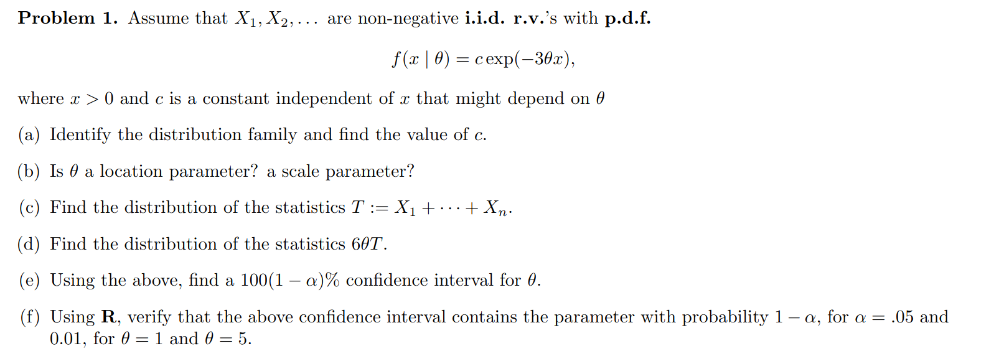
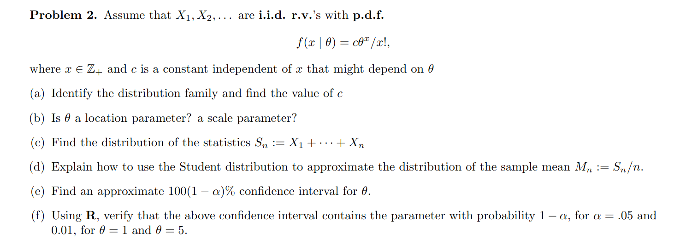
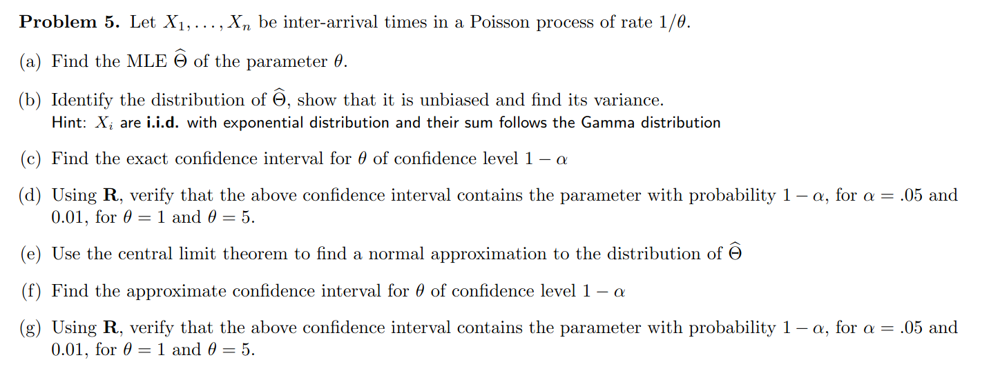

```{r setup, include=FALSE}
# Load necessary libraries
knitr::opts_chunk$set(echo = TRUE)
```

## Problem 1

### Problem Statement



### Solution

```{r}
alpha_values <- c(0.05, 0.01)
theta_values <- c(1, 5)
n <- 30

num_simulations <- 10000

compute_confidence_interval <- function(theta, alpha, n) {
  T <- sum(rexp(n, rate = 3 * theta))
  Q_alpha_low <- qgamma(alpha / 2, shape = n, rate = 1/2)
  Q_alpha_high <- qgamma(1 - alpha / 2, shape = n, rate = 1/2)
  ci_lower <- Q_alpha_low / (6 * T)
  ci_upper <- Q_alpha_high / (6 * T)
  return(c(ci_lower, ci_upper))
}

results <- data.frame(theta = numeric(), alpha = numeric(), coverage = numeric())
for (theta in theta_values) {
  for (alpha in alpha_values) {
    covered <- 0
    for (i in 1:num_simulations) {
      ci <- compute_confidence_interval(theta, alpha, n)
      if (ci[1] <= theta && theta <= ci[2]) {
        covered <- covered + 1
      }
    }
    coverage_probability <- covered / num_simulations
    results <- rbind(results, data.frame(theta = theta, alpha = alpha, coverage = coverage_probability))
  }
}

print(results)

```

------------------------------------------------------------------------

## Problem 2

### Problem Statement



### Solution

```{r}
alpha <- c(0.05, 0.01)
theta_vals <- c(1, 5)
n <- 30
num_simulations <- 10000

for (theta in theta_vals) {
  for (a in alpha) {
    z_alpha <- qnorm(1 - a / 2)
    coverage <- 0
    
    for (i in 1:num_simulations) {
      X <- rpois(n, lambda = theta)
      M_n <- mean(X)
      CI_lower <- M_n - z_alpha * sqrt(M_n / n)
      CI_upper <- M_n + z_alpha * sqrt(M_n / n)
      
      if (CI_lower <= theta && CI_upper >= theta) {
        coverage <- coverage + 1
      }
    }
    
    coverage_prob <- coverage / num_simulations
    cat(sprintf("For theta = %g and alpha = %g, coverage probability = %.4f\n", 
                theta, a, coverage_prob))
  }
}
```

------------------------------------------------------------------------

## Problem 5

### Problem Statement



### Solution

Verifying confidence interval for gamma distr

```{r}
n <- 100
theta_values <- c(1, 5)
alpha_values <- c(0.05, 0.01)

verify_confidence_interval <- function(theta, alpha, n, num_simulations=10000) {
  count <- 0
  
  for (i in 1:num_simulations) {
    X <- rexp(n, rate=1/theta)
    S <- sum(X)
    
    lower <- qgamma(alpha/2, n, rate=1)
    upper <- qgamma(1 - alpha/2, n, rate=1)
    
    lower_bound <- S / upper
    upper_bound <- S / lower
    
    if (lower_bound <= theta && theta <= upper_bound) {
      count <- count + 1
    }
  }
  
  cat("Proportion for theta =", theta, "and alpha =", alpha, ":", count / num_simulations, "\n")
}

for (theta in theta_values) {
  for (alpha in alpha_values) {
    verify_confidence_interval(theta, alpha, n)
  }
}
```

Verifying confidence interval for normal distr:

```{r}
verify_normal_approx <- function(theta, alpha, n, num_simulations=10000) {
  count <- 0
  
  for (i in 1:num_simulations) {
    X <- rexp(n, rate=1/theta)
    theta_hat <- mean(X)
    
    z <- qnorm(1 - alpha/2)
    lower_bound <- theta_hat - z * sqrt(theta_hat^2 / n)
    upper_bound <- theta_hat + z * sqrt(theta_hat^2 / n)
    
    if (lower_bound <= theta && theta <= upper_bound) {
      count <- count + 1
    } 
  }
  
  cat("Proportion for theta =", theta, "and alpha =", alpha, ":", count / num_simulations, "\n")
}

for (theta in theta_values) {
  for (alpha in alpha_values) {
    verify_normal_approx(theta, alpha, n)
  }
}

```
